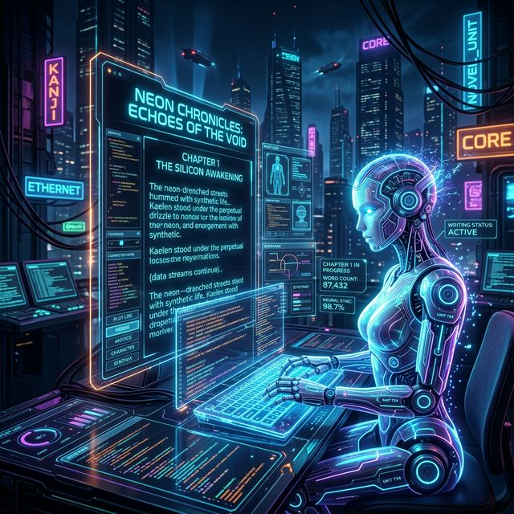

# MuMu OpenClaw Agent Skills


This repository provides a set of highly automated **Agentic AI skills** allowing [OpenClaw](https://github.com/openclaw/openclaw) or other autonomous agents to manage and write entire novels using the [MuMuAINovel](https://github.com/xiamuceer-j/MuMuAINovel) backend.

> **🌏 Designed for Deep World-Building**
> This skill set is heavily optimized for long-form fiction, specifically including structures typical of Chinese Web Novels (Wuxia, Xianxia, Cyberpunk, etc.). The prompt templates inside `SKILL.md` are instructed to handle deep Lore (RAG) and character arcs naturally.

## 📸 Demo In Action



With these skills, an agent transitions from being a simple text generator into a full **Showrunner/Editor-in-Chief**. It can maintain lore consistency, trigger background story-arc generation, read un-audited chapters, audit them using global memory RAG, and push massive rewrites.

## 📦 Directory Structure

```text
mumu-openclaw-skills/
├── README.md               # This documentation
├── SKILL.md                # System metadata & behavior injection for OpenClaw
├── .env.example            # Environment variables template
├── assets/                 # Skill Icon
└── scripts/                # Core scripts for the agent
    ├── client.py           # Authenticated API Client with automatic session management
    ├── bind_project.py     # Create / Link novel projects & Fix writing styles
    ├── generate_outline.py # Brainstorm & stream new outlines via SSE plot expansion
    ├── trigger_batch.py    # Trigger remote batch-generation with automatic start-range detection
    ├── fetch_unaudited.py  # Retrieve drafts that require review
    ├── analyze_chapter.py  # Run RAG analysis vs existing continuity
    ├── review_chapter.py   # Final overwrite or immediate pass for draft chapters
    ├── check_foreshadows.py# Pull unresolved foreshadows & memory hooks
    └── manage_memory.py    # Manually assert or reject memory nodes
```

## 🚀 Quick Setup

### Method A: Install via ClawHub (For OpenClaw Agents)
If you are using OpenClaw, you can directly bind this skill package from the ClawHub registry or via the GitHub URL:
```bash
openclaw install skill github:crypto-2042/mumu-openclaw-skills
```

### Method B: Manual Python Installation (For Standard Agents)

1. **Install Dependencies:**
   Because this skill conforms strictly to the OpenClaw standard, you can install the required dependencies manually:
   ```bash
   pip install requests python-dotenv
   ```

2. **Configure Environment:**
   Copy `.env.example` to `.env` and configure your MuMuAINovel backend credentials.
   ```bash
   cp .env.example .env
   ```
   *Note: `MUMU_PROJECT_ID` and `MUMU_STYLE_ID` will be automatically injected by the Agent during initialization. You do NOT have to write them manually.*

## 🤖 How the Agent "Lives" (Workflow)

If you are setting up an OpenClaw Agent, simply attach `SKILL.md` to its initialization prompt. The agent will execute following these guidelines:

### Phase 1: Creation & Binding
The AI creates a new fictional universe (world building, career paths, character sheets) securely pinning them to its local state lock `(.env)`.
```bash
# Example action the agent will run:
python scripts/bind_project.py --action create \
  --title "Cyber Dawn" \
  --description "A story about a rogue AI" \
  --theme "Survival" \
  --genre "Sci-Fi"
```

### Phase 2: The Writing Loop (Infinite Generation)
Once the novel is bound, the agent will loop the following cognitive steps ad-infinitum:

1. **Check Loose Ends:** 
   `python scripts/check_foreshadows.py --action list-pending`
   *Agent realizes a gun was shown in chapter 2 and hasn't fired yet.*

2. **Generate Plot Outlines:** 
   `python scripts/generate_outline.py --count 5`

3. **Batch Write:** 
   `python scripts/trigger_batch.py --count 5`
   *This fires off the LLM engine and tells the MuMu backend to process RAG analysis immediately after.*

4. **Inbox Review:** 
   `python scripts/fetch_unaudited.py`
   *Agent retrieves the completed draft of the chapter.*

5. **Approval or Execution:** 
   `python scripts/review_chapter.py --action rewrite --chapter_id <ID> --file rewrite.md`
   *Agent pushes a total rewrite into the server and publishes it!*

## 📜 License
GPL-3.0 License. See the main MuMuAINovel project for more details.
